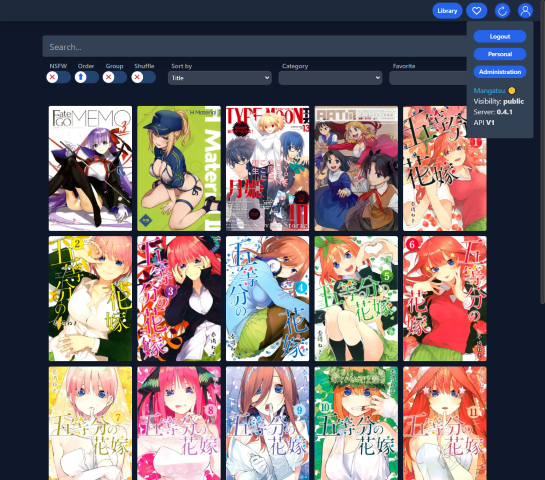
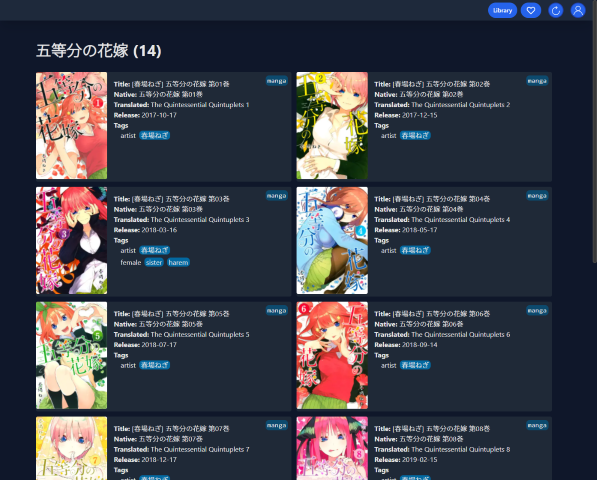
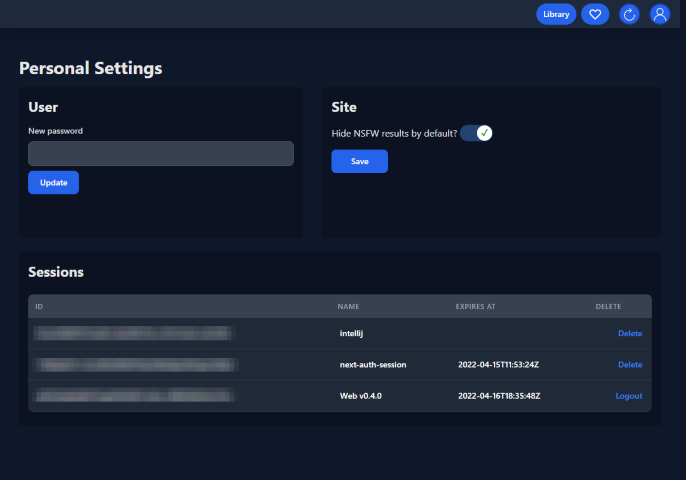

<h1 align="center"> Mangatsu</h1>

  

> 🌕 Server application for **storing**, **tagging** and **reading** doujinshi, manga, art collections and other galleries with API access and user control. Written in Go.
> The name, **Mangatsu**, is a play on Japanese words **mangetsu** (満月, full moon) and **manga** (漫画, comic).

### **[📰 CHANGELOG](docs/CHANGELOG.md)** | **[❤ CONTRIBUTING](docs/CONTRIBUTING.md)**

### At experimental stage until version 1.0.0. Expect breaking changes.

## 📌 Features
- Organizing and tagging local (and remote, with tools like [rclone](https://rclone.org)) collections of manga, doujinshi and other art
  - **Mangatsu will never do any writes inside specified locations.**
  - Supports **ZIP** (or CBZ), **RAR** (or CBR), **7z** and plain image (png, jpg, jpeg, webp, gif, tiff, bmp) files.
    - PDF and video support is planned.
- Metadata parsing from filenames and JSON files (inside or beside the archive)
  - Support for more sources is planned such as TXT files from EH/ExH
- API-access to the collection and archives
  - Extensive filtering, sorting and searching capabilities
  - Additional features for registered users such as tracking reading progress and adding favorite groups. Currently only in API, not in UI.
- User access control
  - **Private**: only logged-in users can access the collection and archives (public registration disabled by default).
  - **Restricted**: users need a global passphrase to access collection and its galleries
  - **Public**: anyone can access (only read) collection and its galleries
  - Assignable roles (admin, member, viewer), and login sessions (can be managed through web)
- Local cache and thumbnail support. _File server can be disabled to allow web servers like NGINX to handle the files._

## 🖼️ Preview

| Main Catalogue                                                                  | Main Catalogue (grouped galleries)                                                                      |
|---------------------------------------------------------------------------------|---------------------------------------------------------------------------------------------------------|
|  |  |

| Gallery Page + Editing                                                                            | Series Listing                                                                                 |
|---------------------------------------------------------------------------------------------------|------------------------------------------------------------------------------------------------|
|  |  |

| User Settings                                                                | Administration                                                               |
|------------------------------------------------------------------------------|------------------------------------------------------------------------------|
|  |  |

## 📌 Clients

### 🌏 Web client
- Included in the Docker setup below
- Source: [Mangatsu Web](http://github.com/Mangatsu/web)

### 📱 [Tachiyomi](https://tachiyomi.org) extension for Android
- Coming soon

## 📌 Installation and usage

### 📖 Guides

- **[📝 Configuration with environmentals](docs/ENVIRONMENTALS.md)**
- **[📚 Library directory structure](docs/LIBRARY.md)**

### 🐳 Docker setup (recommended)
#### DockerHub: [server](https://hub.docker.com/r/luukuton/mangatsu-server/) & [web](https://hub.docker.com/r/luukuton/mangatsu-web) images

- Set up a webserver of your choice. NGINX is recommended.
  - [Example config](docs/nginx.conf). The same config can be used for both the server and the web client. Just change the domains, SSL cert paths and ports.
- Install [Docker](https://docs.docker.com/engine/install/) (Linux, Windows or MacOS)
- Local archives
  - Download the [docker-compose.example.yml](docs/docker-compose.example.yml) and rename it to docker-compose.yml
  - Edit the docker-compose.yml file to your needs
  - Create data and archive directories
- Network archives with [Rclone](https://rclone.org)
  - Follow the [guide on Rclone site](https://rclone.org/docker/)
  - Download the [docker-compose.rclone.yml](docs/docker-compose.rclone.yml) and rename it to docker-compose.yml
- Run `docker-compose up -d` to start the server and web client
- Update by running `docker-compose down`, `docker-compose pull` and then `docker-compose up -d`

### 💻 Local setup

- Set up server
  - Copy example.env as .env and change the values according to your needs
  - Build `go build ./cmd/mangatsu-server`
  - Run `./mangatsu-server` (`mangatsu-server.exe` on Windows)
- Set up web
  - [Guide on github.com/Mangatsu/web](https://github.com/Mangatsu/web)
